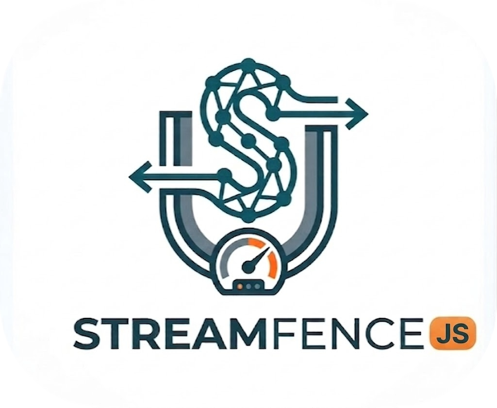

# StreamFenceJs - Embeddable JS Socket.IO Server Library

<p align="center">
  
</p>

<p align="center">
  <a href="https://github.com/MoshPe/StreamFenceJs/actions/workflows/ci.yml"></a>
  <a href="https://github.com/MoshPe/StreamFenceJs/actions/workflows/codeql.yml"></a>
  <a href="https://codecov.io/github/MoshPe/StreamFenceJs"></a>
  <a href="https://www.npmjs.com/package/streamfence-js"></a>
  <a href="https://github.com/MoshPe/StreamFenceJs/releases"></a>
  <a href="https://nodejs.org"></a>
  <a href="https://www.apache.org/licenses/LICENSE-2.0"></a>
</p>

Production-ready delivery control for Node.js Socket.IO servers — backpressure, retries, queue protection, and configurable per-namespace delivery modes.

TypeScript-first port of the Java [StreamFence](https://github.com/MoshPe/StreamFence) library.

---

## What it is

StreamFenceJs wraps your Socket.IO server with a delivery control layer that prevents clients from being overwhelmed, ensures critical messages arrive even over unreliable connections, and gives you fine-grained observability into what happens when things go wrong.

Each Socket.IO namespace gets its own delivery policy: choose between fire-and-forget `BEST_EFFORT` or acknowledged `AT_LEAST_ONCE` delivery, configure per-client queue limits, and select an overflow strategy. The library handles per-client queuing, backpressure, retry scheduling, and Prometheus metrics — so your application code just calls `server.publish()`.

---

## When to use one server vs two

For most production workloads, run **two separate servers**:

| Server | Port | Namespaces | Delivery |
|---|---|---|---|
| Feed server | 3000 | `/feed`, `/prices`, `/updates` | `BEST_EFFORT` — high-frequency, loss-tolerant |
| Control server | 3001 | `/commands`, `/alerts` | `AT_LEAST_ONCE` — low-frequency, reliable |

**Why separate ports?** `AT_LEAST_ONCE` retries and acknowledgment tracking add per-message overhead. Mixing reliable and best-effort traffic on one server causes the reliable path's queue pressure to affect broadcast latency. Separating them keeps each server tuned to its workload.

Both servers can run in the same Node.js process.

---

## Install

```bash
npm install streamfence-js
```

Requires Node.js ≥ 20.

---

## Quick start

```typescript
import {
  StreamFenceServerBuilder,
  NamespaceSpec,
  DeliveryMode,
  OverflowAction,
} from 'streamfence-js';

const feedSpec = NamespaceSpec.builder('/feed')
  .topic('snapshot')
  .deliveryMode(DeliveryMode.BEST_EFFORT)
  .overflowAction(OverflowAction.DROP_OLDEST)
  .maxQueuedMessagesPerClient(128)
  .build();

const server = new StreamFenceServerBuilder()
  .port(3000)
  .namespace(feedSpec)
  .buildServer();

await server.start();
console.log('Listening on port', server.port);

// Publish to all subscribers of /feed > snapshot
server.publish('/feed', 'snapshot', { price: 42.5, ts: Date.now() });

// Graceful shutdown
process.on('SIGINT', async () => {
  await server.stop();
  process.exit(0);
});
```

**Socket.IO client side:**

```javascript
import { io } from 'socket.io-client';

const socket = io('http://localhost:3000/feed');

socket.on('connect', () => {
  socket.emit('subscribe', { topic: 'snapshot' });
});

socket.on('topic-message', ({ metadata, payload }) => {
  console.log('received', metadata.topic, payload);
  // For AT_LEAST_ONCE namespaces, acknowledge the message:
  if (metadata.ackRequired) {
    socket.emit('ack', { topic: metadata.topic, messageId: metadata.messageId });
  }
});
```

---

## Config file loading

Instead of building servers programmatically you can load them from a YAML or JSON config file. A single file can define multiple named server entries.

```typescript
import { StreamFenceServerBuilder } from 'streamfence-js';

const feedServer = StreamFenceServerBuilder
  .fromYaml('./streamfence.yaml', { server: 'feed' })
  .buildServer();

const controlServer = StreamFenceServerBuilder
  .fromYaml('./streamfence.yaml', { server: 'control' })
  .buildServer();
```

You can continue customising the builder after loading:

```typescript
const server = StreamFenceServerBuilder
  .fromYaml('./streamfence.yaml', { server: 'feed' })
  .listener(myEventListener)
  .metrics(new PromServerMetrics())
  .buildServer();
```

### Config file schema

```yaml
servers:
  feed:                                    # server name — used in fromYaml/fromJson
    host: "0.0.0.0"                        # optional, default "0.0.0.0"
    port: 3000                             # required
    managementPort: 9100                   # optional — enables /health and /metrics HTTP endpoints
    transport: WS                          # optional — WS | WSS, default WS
    engineIoTransport: WEBSOCKET_OR_POLLING  # optional — WEBSOCKET_ONLY | WEBSOCKET_OR_POLLING
    auth: NONE                             # optional — NONE | TOKEN, default NONE
    spillRootPath: ".streamfence-spill"    # optional, default ".streamfence-spill"
    tls:                                   # optional — required when transport: WSS
      certChainPemPath: "/etc/ssl/cert.pem"
      privateKeyPemPath: "/etc/ssl/key.pem"
      protocol: "TLSv1.3"                  # optional, default TLSv1.3
    namespaces:
      - path: /feed                        # required — must start with /
        topics: [snapshot, delta]          # required — at least one
        deliveryMode: BEST_EFFORT          # optional — BEST_EFFORT | AT_LEAST_ONCE
        overflowAction: DROP_OLDEST        # optional — see Overflow policies below
        maxQueuedMessagesPerClient: 128    # optional, default 64
        maxQueuedBytesPerClient: 1048576   # optional, default 524288 (512 KiB)
        ackTimeoutMs: 1000                 # optional, default 1000
        maxRetries: 0                      # optional, default 0
        coalesce: false                    # optional, default false
        allowPolling: true                 # optional, default true
        maxInFlight: 1                     # optional, default 1
        authRequired: false                # optional, default false
```

JSON format is also supported — same structure, `.json` extension. Use `fromJson()` instead of `fromYaml()`.

---

## Delivery modes

| Mode | Guarantee | Acks | Use case |
|---|---|---|---|
| `BEST_EFFORT` | At most once | None | Live feeds, price tickers, position updates |
| `AT_LEAST_ONCE` | At least once | Required | Commands, alerts, critical state changes |

`AT_LEAST_ONCE` requirements (enforced at build time):
- `overflowAction` must be `REJECT_NEW`
- `coalesce` must be `false`
- `maxRetries` must be ≥ 1
- `maxInFlight` must not exceed `maxQueuedMessagesPerClient`

---

## Overflow policies

Applied when a client's per-topic queue is full and a new message arrives.

| Action | Behaviour | Best for |
|---|---|---|
| `REJECT_NEW` | Incoming message rejected; publisher receives `QueueOverflowEvent` | `AT_LEAST_ONCE`; reliable back-pressure |
| `DROP_OLDEST` | Oldest queued message dropped; new message accepted | Live feeds where stale data is harmless |
| `COALESCE` | Most recent same-topic entry replaced with new one | Ticker data — only latest value matters |
| `SNAPSHOT_ONLY` | All queued messages discarded; only new message kept | Single-value snapshot feeds |
| `SPILL_TO_DISK` | Not supported in v1 (returns rejected) | — |

---

## Authentication

Set `auth: TOKEN` (config) or `.authMode(AuthMode.TOKEN)` (builder) and provide a `TokenValidator`:

```typescript
import { AuthMode, AuthDecision, type TokenValidator } from 'streamfence-js';

const validator: TokenValidator = {
  validate(token, namespace, topic) {
    if (token === 'secret-token') {
      return AuthDecision.accept('user-alice');
    }
    return AuthDecision.reject('invalid token');
  },
};

const server = new StreamFenceServerBuilder()
  .port(3000)
  .authMode(AuthMode.TOKEN)
  .tokenValidator(validator)
  .namespace(spec)
  .buildServer();
```

`TokenValidator.validate()` may return a plain `AuthDecision` or a `Promise<AuthDecision>` for async validation (database lookups, JWT verification, etc.).

---

## TLS

```typescript
import { TransportMode, TlsConfig } from 'streamfence-js';

const server = new StreamFenceServerBuilder()
  .port(3000)
  .transportMode(TransportMode.WSS)
  .tlsConfig(TlsConfig.create({
    certChainPemPath: '/etc/ssl/cert.pem',
    privateKeyPemPath: '/etc/ssl/key.pem',
    // protocol: 'TLSv1.3',       // default
    // privateKeyPassword: '...',  // optional
  }))
  .namespace(spec)
  .buildServer();
```

---

## Metrics & management

Use `PromServerMetrics` for Prometheus-format metrics, and enable the management HTTP server for scraping.

```typescript
import { PromServerMetrics } from 'streamfence-js';

const server = new StreamFenceServerBuilder()
  .port(3000)
  .managementPort(9100)           // enables GET /health and GET /metrics
  .metrics(new PromServerMetrics())
  .namespace(spec)
  .buildServer();
```

After starting, `GET http://localhost:9100/metrics` returns Prometheus text format and `GET http://localhost:9100/health` returns `{ "status": "UP", "uptimeMs": ... }`.

**Available metrics:**

| Metric | Labels |
|---|---|
| `streamfence_connections_total` | `namespace` |
| `streamfence_disconnections_total` | `namespace` |
| `streamfence_messages_published_total` | `namespace`, `topic` |
| `streamfence_messages_published_bytes_total` | `namespace`, `topic` |
| `streamfence_messages_received_total` | `namespace`, `topic` |
| `streamfence_queue_overflow_total` | `namespace`, `topic`, `reason` |
| `streamfence_retries_total` | `namespace`, `topic` |
| `streamfence_retries_exhausted_total` | `namespace`, `topic` |
| `streamfence_messages_dropped_total` | `namespace`, `topic` |
| `streamfence_messages_coalesced_total` | `namespace`, `topic` |
| `streamfence_auth_rejected_total` | `namespace` |

---

## Event listener

```typescript
import type { ServerEventListener } from 'streamfence-js';

const listener: ServerEventListener = {
  onClientConnected(event) {
    console.log('Client connected:', event.clientId, 'on', event.namespace);
  },
  onQueueOverflow(event) {
    console.warn('Queue overflow:', event.namespace, event.topic, event.reason);
  },
  onRetryExhausted(event) {
    console.error('Retry exhausted:', event.messageId, 'after', event.retryCount, 'attempts');
  },
};

const server = new StreamFenceServerBuilder()
  .port(3000)
  .listener(listener)
  .namespace(spec)
  .buildServer();
```

All callbacks are optional — only implement what you need. Exceptions thrown from callbacks are caught and logged; they never crash the server.

---

## API reference

### Enums

| Export | Values |
|---|---|
| `DeliveryMode` | `BEST_EFFORT`, `AT_LEAST_ONCE` |
| `OverflowAction` | `DROP_OLDEST`, `REJECT_NEW`, `COALESCE`, `SNAPSHOT_ONLY`, `SPILL_TO_DISK` |
| `TransportMode` | `WS`, `WSS` |
| `AuthMode` | `NONE`, `TOKEN` |
| `EngineIoTransportMode` | `WEBSOCKET_ONLY`, `WEBSOCKET_OR_POLLING` |
| `InboundAckPolicy` | `ACK_ON_RECEIPT`, `ACK_AFTER_HANDLER_SUCCESS` |

### Classes & factories

| Export | Description |
|---|---|
| `StreamFenceServerBuilder` | Fluent builder for server configuration; `fromYaml()`, `fromJson()` static factories |
| `StreamFenceServer` | Running server instance — `start()`, `stop()`, `publish()`, `publishTo()`, `onMessage()` |
| `NamespaceSpec` / `NamespaceSpecBuilder` | Namespace policy builder |
| `AuthDecision` | `accept(principal)` / `reject(reason)` factory |
| `TlsConfig` | `create(input)` factory |
| `PromServerMetrics` | Prometheus metrics implementation |
| `NoopServerMetrics` | No-op metrics (default) |

### Interfaces

| Export | Description |
|---|---|
| `TokenValidator` | Custom token authentication |
| `ServerEventListener` | Optional lifecycle + runtime event callbacks |
| `ServerMetrics` | Metrics recording interface |
| `StreamFenceServerSpec` | Immutable server configuration |
| `InboundMessageContext` | Context passed to `onMessage` handlers |
| `InboundMessageHandler` | Handler type: `(payload, context) => void \| Promise<void>` |

---

## Examples

See [`examples/`](./examples/) for runnable code:

- **[mixed-workload](./examples/mixed-workload/)** — two servers from a single YAML config: a BEST_EFFORT feed server and an AT_LEAST_ONCE control server
- **[single-server](./examples/single-server/)** — programmatic builder API, one namespace

Run with:

```bash
npx tsx examples/mixed-workload/server.ts
```

---

## Status / roadmap

v1 is complete and publish-ready. Planned for v2:

- `SPILL_TO_DISK` filesystem backend
- TLS PEM hot reload

---

## License

[Apache-2.0](LICENSE)
